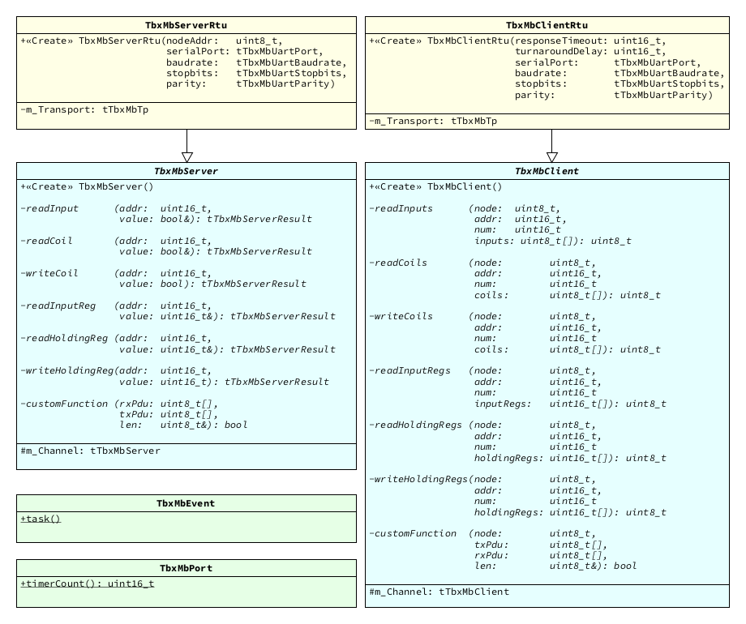

# Extra functionality

## C++ Wrappers

No exact statistics on C++ usage for embedded systems is available. However, the rough estimation is that somewhere between at least 20% and 50% of all embedded software projects make use of C++. Unfortunately, most embedded components and libraries do not take this into consideration. 

This is where MicroTBX-Modbus differs: Its C API was carefully crafted, such that easy-to-use C++ wrappers can encompass its entire functionality. In fact, it's actually easier to code with MicroTBX-Modbus in C++, compared to C. This section presents how to use the included C++ wrappers. 

### Design

The following illustration presents the UML class diagrams of the C++ wrappers:




### Integration

To add the C++ wrappers to your software project, complete the following steps:

1. Copy all files from the `source/extra/cplusplus/` directory to your project.
2. Configure your project such that the added `.cpp` files are compiled and linked during a build.
3. Add the directories that contain the `.hpp` files to your compiler's include search path.

Alternatively, when using CMake to manager your project's build system, add `microtbx-modbus-extra-cpp` to its `target_link_libraries()` list. 

Add the following lines to each source-file, where you intend to make use of MicroTBX-Modbus:

```c
#include <microtbx.h>
#include <microtbxmodbus.hpp>
```

###  Modbus server

TODO

### Modbus client

TODO
